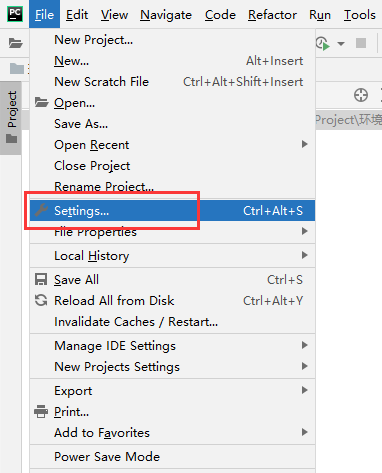

<center><h3>开发环境搭建</h3></center>

主要讲一下下面两种环境搭建：

- 本地开发环境搭建
- 远程开发环境搭建

不过都需要使用到虚拟环境，目前虚拟环境管理较多的方法有这么三种：

1. anaconda
2. virtualenv
3. pipenv

#### 一、本地开发环境搭建

本地开发就使用anaconda + pycharm 来进行开发：

##### （一）下载anaconda

- 官网下载 https://www.anaconda.com/products/individual#Downloads
- 仓库 https://repo.anaconda.com/archive/
- 清华镜像源 https://mirrors.tuna.tsinghua.edu.cn/anaconda/archive/

这里选择下载合适的版本，目前我python使用的是python3.8.5的版本，所以下载https://mirrors.tuna.tsinghua.edu.cn/anaconda/archive/Anaconda3-2020.11-Windows-x86_64.exe

这里我已经上传到百度云了，大家可以自行食用：

链接：https://pan.baidu.com/s/1xrPt99SaxeiOfURE7SNsJw 
提取码：z0bk 

##### （二）安装

安装较为简单，基本就是一直next就可以了。需要注意的两个地方一个是安装

- 选择 All User选项

​                              

- 选择系统环境变量 选择第一个选项


##### （三）配置

选择虽然安装完了，但是还需要配置镜像源，这和pip源是一样的，都需要配置，这样拉包比较快，查看：

[anaconda | 镜像站使用帮助 | 清华大学开源软件镜像站 | Tsinghua Open Source Mirror](https://mirror.tuna.tsinghua.edu.cn/help/anaconda/)

我们在用户家目录下新建一个.condarc文件，然后写入下面信息：

> channels:
>   - defaults
> show_channel_urls: true
> default_channels:
>   - https://mirrors.tuna.tsinghua.edu.cn/anaconda/pkgs/main
>   - https://mirrors.tuna.tsinghua.edu.cn/anaconda/pkgs/free
>   - https://mirrors.tuna.tsinghua.edu.cn/anaconda/pkgs/r
>     custom_channels:
>     conda-forge: https://mirrors.tuna.tsinghua.edu.cn/anaconda/cloud
>     msys2: https://mirrors.tuna.tsinghua.edu.cn/anaconda/cloud
>     bioconda: https://mirrors.tuna.tsinghua.edu.cn/anaconda/cloud
>     menpo: https://mirrors.tuna.tsinghua.edu.cn/anaconda/cloud
>     pytorch: https://mirrors.tuna.tsinghua.edu.cn/anaconda/cloud

此时所有的软件包都是从清华镜像源拉取。

##### （四）使用

- 新建虚拟环境

```shell
conda create -n testEnv python=3.8.5
```

- 查看包

```shell
conda list
```

- 删除虚拟环境

```shell
conda remove -n testEnv --all
```

##### （五）IDE中使用虚拟环境

打开pycharm:




#### 二、远程开发环境搭建

##### （一）下载anaconda

下载地址：https://mirrors.tuna.tsinghua.edu.cn/anaconda/archive/Anaconda3-2020.11-Linux-x86_64.sh

或者可以直接通过wget进行下载：

```shell
wget https://mirrors.tuna.tsinghua.edu.cn/anaconda/archive/Anaconda3-2020.11-Linux-x86_64.sh
```

这里我已经上传到百度云了，大家可以自行食用：

链接：https://pan.baidu.com/s/1yxm6aUoQ7_lkuZCXR50Ctw 
提取码：iok7 

##### （二）安装

下载完毕后可以使用xftp上传到服务器上。然后进行安装：

```shell
/bin/sh Anaconda3-2020.11-Linux-x86_64.sh
```

安装过程：


这样就安装成功了。

注意此时需要重新打开终端，如果退出当前虚拟环境使用：

```she
conda deactivate
```

##### （三）配置

这和windows中安装大同小异，配置conda源，在家目录下新建 .condarc 文件，写入：

```shell
channels:
  - defaults
show_channel_urls: true
default_channels:
  - https://mirrors.tuna.tsinghua.edu.cn/anaconda/pkgs/main
  - https://mirrors.tuna.tsinghua.edu.cn/anaconda/pkgs/free
  - https://mirrors.tuna.tsinghua.edu.cn/anaconda/pkgs/r
custom_channels:
  conda-forge: https://mirrors.tuna.tsinghua.edu.cn/anaconda/cloud
  msys2: https://mirrors.tuna.tsinghua.edu.cn/anaconda/cloud
  bioconda: https://mirrors.tuna.tsinghua.edu.cn/anaconda/cloud
  menpo: https://mirrors.tuna.tsinghua.edu.cn/anaconda/cloud
  pytorch: https://mirrors.tuna.tsinghua.edu.cn/anaconda/cloud
```

##### （四）使用

- 新建虚拟环境

```shell
conda create -n testEnv python=3.8.5
```

- 查看包

```shell
conda list
```

```she
pip list
```

- 删除虚拟环境

```shell
conda remove -n testEnv --all
```

##### （五）IDE配置远程环境

分成三步：

1. 设置远程与本地的映射
2. 设置python解释器
3. 文件同步

###### 1.设置远程与本地的映射

现在服务器上建一个项目的文件夹：

```shell
(testEnv) [root@localhost ~]# mkdir project
(testEnv) [root@localhost ~]# cd project/
(testEnv) [root@localhost project]# pwd
/root/project
```

然后启动本地的IDE进行相关的配置：

- 远程映射


- 目录映射


###### 2. 设置python解释器


注意勾选下面的自动上传到服务器。

###### 3. 文件同步

无论是你本地的文件上传到服务器上进行运行，还是服务器上的文件同步到你本地都可行。


